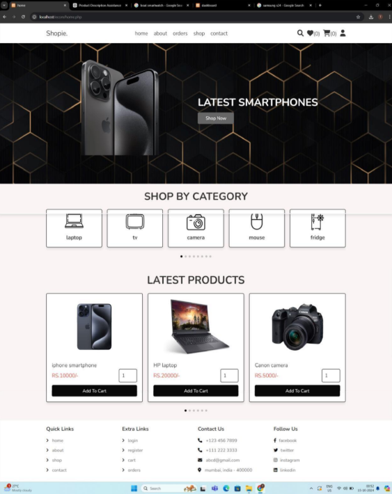
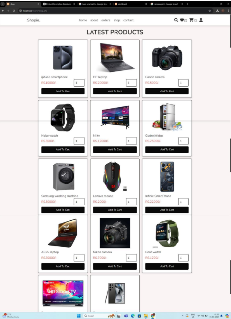
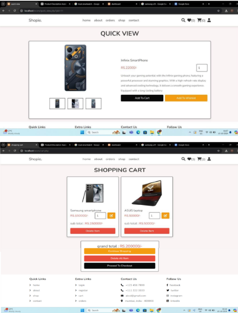
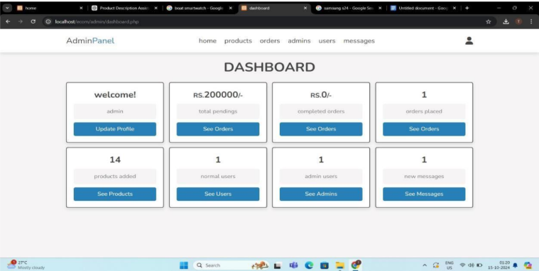
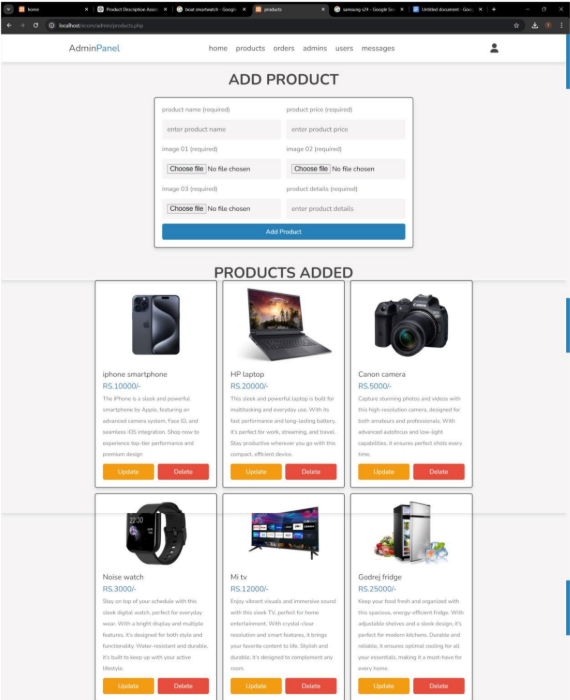
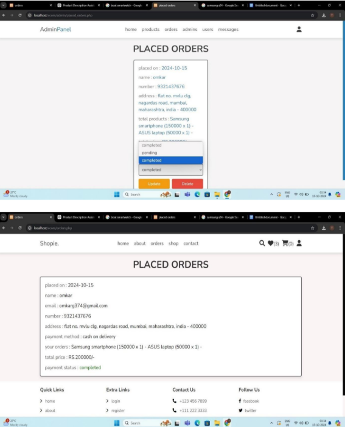

# Electronics E-commerce Website

Welcome to my Electronics E-commerce Website project repository! This project is built using HTML, CSS, JavaScript, PHP & MySQL.

---

## Website Preview

  
  
  
  
  

---

## Features
🛍️ Main Website Features:
🔐 User Authentication – Login & Registration system
🏠 Home Page – Clean and responsive UI
🔍 Search Functionality – Find products easily
📂 Product Categories – Organized product browsing
👁️ Quick View – Instantly see product details
🛒 Shopping Cart – Add, view, and manage selected items

## Admin Panel Functionalities:
📊 Dashboard Overview – Quick glance at site activity
👤 Admin Profile Management – Update admin details
📦 Order Management – View Pending & Completed orders
➕ Product Management – Add, edit, or remove products
👥 User & Admin Control – Manage user and admin accounts
📨 Message Center – View messages sent by customers  

